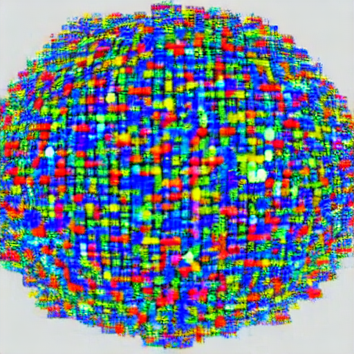

# U-Net Architecture Implementation

Welcome to the repository for our ongoing implementation of the U-Net architecture using PyTorch! This project aims to provide a comprehensive, from-scratch implementation of the U-Net architecture, which has demonstrated remarkable performance in various medical image segmentation tasks and beyond.

## Table of Contents

- [Introduction](#introduction)
- [Project Status](#project-status)
- [Features](#features)
- [Getting Started](#getting-started)

## Introduction

The U-Net architecture, introduced in the paper "U-Net: Convolutional Networks for Biomedical Image Segmentation" by Ronneberger et al., is a widely used convolutional neural network architecture for tasks like image segmentation. Its unique design, with a contracting and an expansive path, allows for accurate pixel-level predictions while leveraging contextual information.

This repository aims to provide a step-by-step implementation of the U-Net architecture in PyTorch, offering a hands-on opportunity for both newcomers and experienced practitioners to understand the architecture's intricacies.

## Project Status

🎉 **Project Completed**: This project is now complete! We've implemented the  U-Net architecture.

Feel free to explore the completed implementation and dive into the details of the U-Net model. If you have any questions or suggestions, don't hesitate to reach out.

## Features

- In-depth implementation of the essential components of the U-Net architecture.
- Educational code comments and explanations to facilitate understanding.
- Utilization of PyTorch for a flexible and accessible implementation.

## Getting Started

To get started with our U-Net architecture implementation:

1. Clone this repository.
2. Explore the codebase to gain insights into the ongoing implementation.
3. Feel free to experiment, make modifications, and contribute to the project's development.

Your collaboration is valuable, and we hope that this project enriches your understanding of the U-Net architecture and its applications.

