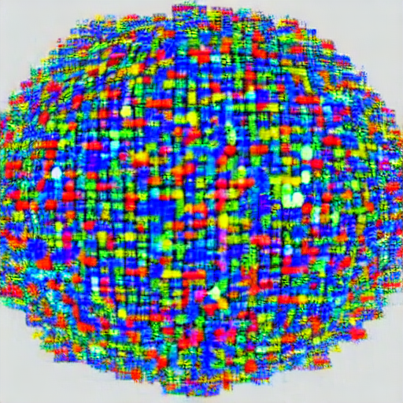

# U-Net Mimarisi Implementasyonu

PyTorch kullanarak U-Net mimarisini implement ettiğimiz repoya hoş geldiniz! Bu proje, çeşitli tıbbi görüntü segmentasyon görevlerinde ve ötesinde dikkate değer performans gösteren U-Net mimarisinin kapsamlı, sıfırdan bir implementasyonunu sağlamayı amaçlamaktadır.

## İçindekiler

- **Giriş**
- **Proje Durumu**
- **Özellikler**
- **Başlarken**

## Giriş

U-Net mimarisi, "U-Net: Convolutional Networks for Biomedical Image Segmentation" adlı makalede tanıtılan, görüntü segmentasyon gibi görevler için yaygın olarak kullanılan bir konvolüsyonel sinir ağı mimarisidir. Benzersiz tasarımı, bir daraltma (contraction) ve bir genişletme (expansion) yolu ile, piksel seviyesinde doğru tahminler yapma yeteneği sağlarken bağlamsal bilgiyi kullanmasına imkan tanır.

Bu repo, U-Net mimarisinin PyTorch kullanılarak adım adım implementasyonunu sağlayarak, hem yeni başlayanların hem de deneyimli uygulayıcıların bu mimarinin karmaşıklıklarını anlamalarına fırsat sunmayı amaçlar.

## Proje Durumu

🎉 **Proje Tamamlandı**: Bu proje artık tamamlandı! U-Net mimarisini PyTorch kullanarak implement ettik.

Tamamlanan implementasyonu keşfetmekten ve U-Net mimarisinin ayrıntılarına dalmaktan çekinmeyin. Herhangi bir sorunuz veya öneriniz varsa lütfen bize ulaşınız.

## Özellikler

- U-Net mimarisinin temel bileşenlerinin ayrıntılı implementasyonu.
- Anlaşılmasına yardımcı olmak için eğitici kod yorum ve açıklamaları.
- Esnek ve erişilebilir bir implementasyon için PyTorch kullanımı.

## Başlarken

U-Net mimarisi implementasyonumuza başlamak için:

1. Bu repoyu klonlayın.
2. Kod tabanını keşfetmek için ilgili dizine gidin.
3. Deney yapmak, değişiklikler yapmak ve projeye katkıda bulunmak için özgürsünüz.

