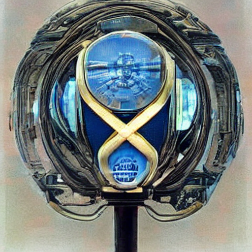

# Vision Transformer (ViT) Model Implementation

Welcome to the repository for our ongoing implementation of the Vision Transformer (ViT) model using PyTorch! This project aims to provide a comprehensive, from-scratch implementation of the ViT architecture, which has shown remarkable performance in image classification tasks and has contributed to the advancement of computer vision.

## Table of Contents

- [Introduction](#introduction)
- [Project Status](#project-status)
- [Features](#features)
- [Getting Started](#getting-started)

## Introduction

The Vision Transformer (ViT) model, introduced in the paper "An Image Is Worth 16x16 Words: Transformers for Image Recognition at Scale" by Dosovitskiy et al., challenges the traditional convolutional neural networks (CNNs) by utilizing transformer-based self-attention mechanisms for image classification. It demonstrates the effectiveness of transformers in handling image data directly, opening new avenues for research and applications in computer vision.

This repository aims to provide a step-by-step implementation of the Vision Transformer in PyTorch, allowing both newcomers and experienced practitioners to explore the inner workings of this groundbreaking model.

## Project Status

🎉 **Project Completed**: This project is now complete! We've implemented the main components of the Transformer architecture.

Feel free to explore the completed implementation and dive into the details of the Transformer model. If you have any questions or suggestions, don't hesitate to reach out.

## Features

- In-depth implementation of the essential components of the Vision Transformer architecture.
- Educational code comments and explanations to facilitate understanding.
- Utilization of PyTorch for a flexible and accessible implementation.

## Getting Started

To get started with our Vision Transformer implementation:

1. Clone this repository.
2. Explore the codebase to gain insights into the ongoing implementation.
3. Feel free to experiment, make modifications, and contribute to the project's development.

We welcome your collaboration and hope that this project enhances your understanding of the Vision Transformer model.

